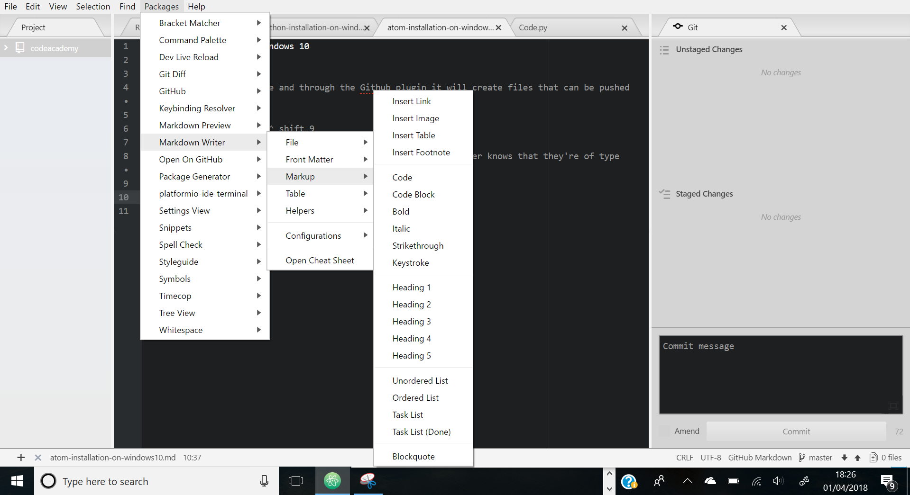

# Atom Installation on Windows 10

Atom is used to write code and through the Github plugin it will create files that can be pushed to Github. I installed a couple of packages to make writer in markdown a little easier.

To display the Git pane, ^ shift 9

Files need to be saved with the .md extension so that your computer knows that they're of type markdown.

To open a markdown preview ^ shift m
